# x940: Technical Architecture

## 1. Overview

x940 is a **Cargo workspace** containing four crates:

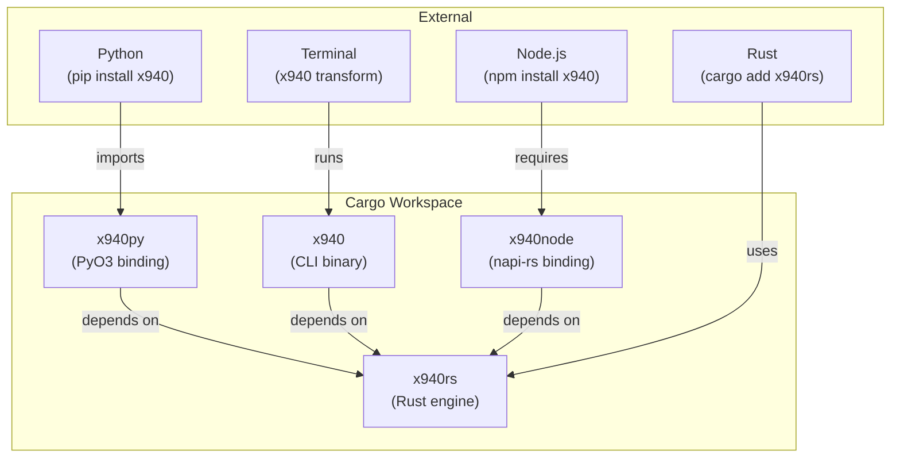

| Crate       | Role                                            |
|-------------|-------------------------------------------------|
| `x940rs`    | All business logic: parsing, models, decoders, serializers |
| `x940py`    | PyO3 binding: exposes `MT940` class to Python   |
| `x940`      | CLI binary via `clap`                           |
| `x940node`  | napi-rs binding: native Node.js addon           |

**Golden rule**: All business logic lives in `crates/core`. Every other crate
is a thin adapter. A bug fix in `core` benefits all consumers automatically.

## 2. Data Flow

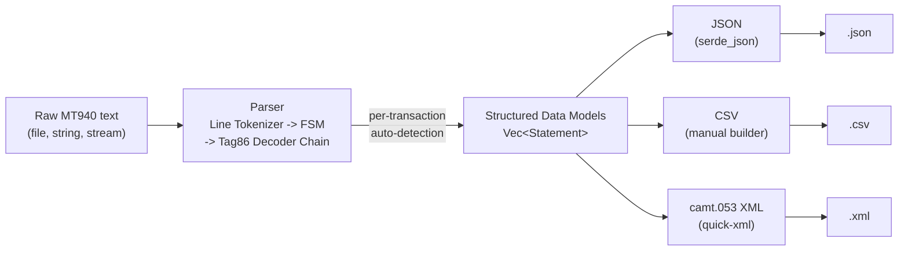

## 3. Parser Architecture

### 3.1 Finite State Machine (FSM)

```mermaid
stateDiagram-v2
    [*] --> START
    START --> HEADER: :20:
    HEADER --> HEADER: :21:
    HEADER --> HEADER: :25:
    HEADER --> HEADER: :28C:
    HEADER --> BODY: :60F: or :60M:
    BODY --> BODY: :61:
    BODY --> BODY: :86:
    BODY --> FOOTER: :62F: or :62M:
    FOOTER --> FOOTER: :64:
    FOOTER --> FOOTER: :65:
    FOOTER --> FOOTER: :86: (standalone)
    FOOTER --> HEADER: :20: (next statement)
    FOOTER --> [*]
```

### 3.2 Tag 86 Decoder Chain (Per-Transaction Auto-Detection)

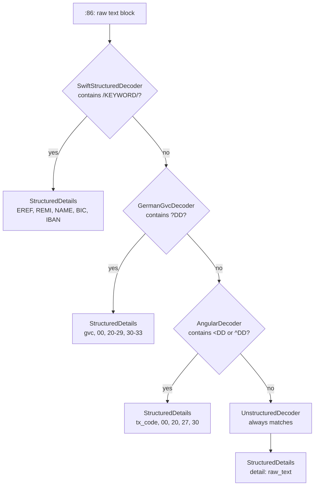

### 3.3 Resolver = Priority, Not Lock

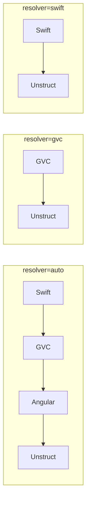

When an explicit resolver is passed, the chain is shortened to
`[ChosenDecoder, UnstructuredDecoder]`. Transactions that don't match the
chosen dialect fall through to the unstructured safety net: no parse
errors, no data loss.

### 3.4 Tag 86 Multi-Line Concatenation (No-Space Rule)

```mermaid
flowchart LR
    line1["TRANSACTION THAT\n"]
    line2["SHOULD CONTINUOUSLY PARSE"]
    concat["TRANSACTION THATSHOULD CONTINUOUSLY PARSE"]

    line1 -->|"strip newline<br/>no space injection"| concat
    line2 -->|""| concat
```

### 3.5 :61: Continuation Lines (SWIFT [34x])

Per the SWIFT specification, the `[34x]` supplementary details field can spill
onto continuation lines after `:61:` without a tag prefix. The tokenizer
inserts `\n` as a separator (unlike :86: which uses the no-space rule), and the
parser extracts the continuation text into `Transaction.supplementary`.

### 3.6 Two Representations in Transaction

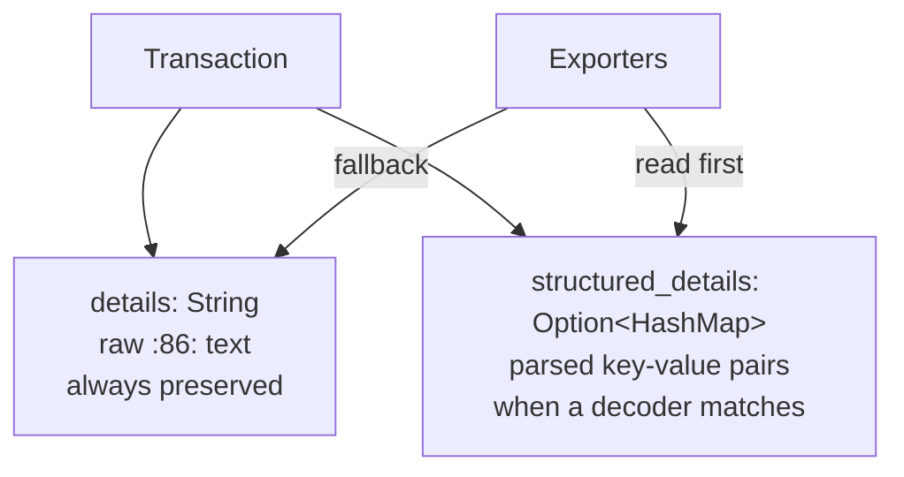

## 4. Key Design Decisions

### 4.1 Amount Storage: Absolute + Debit/Credit Flag

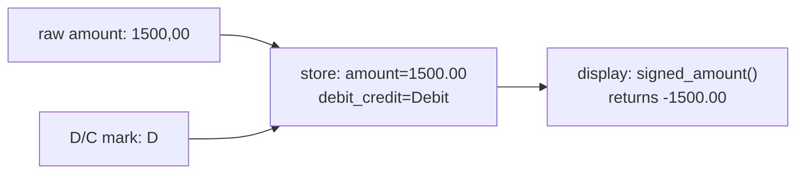

| Export     | Amount Format    |
|------------|-----------------|
| JSON       | Signed (negative for D, RC) |
| CSV        | Signed (negative for D, RC) |
| camt.053   | Absolute (sign in CdtDbtInd) |

### 4.2 Reversal Handling

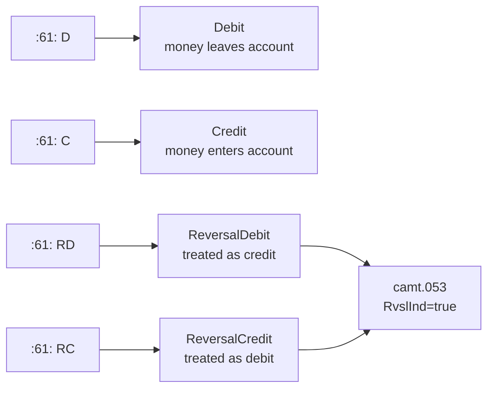

### 4.3 Trait-Based Decoders

| Format                | Region                 | Delimiter | Decoder                 |
|-----------------------|------------------------|-----------|------------------------|
| SWIFT structured      | International, SEPA    | `/`       | `SwiftStructuredDecoder` |
| German GVC            | Germany, Austria, CH   | `?`       | `GermanGvcDecoder`       |
| Angular (Polish)      | Poland, Czechia        | `<`       | `AngularDecoder`         |
| Angular (Nordic)      | Nordics                | `^`       | `AngularDecoder`         |
| Unstructured          | US, Asia, legacy       | (none)    | `UnstructuredDecoder`    |

### 4.4 Multi-Statement Handling

The Rust API returns `Vec<Statement>`: multiple statements per file. The
Python and Node.js `MT940` classes wrap the full vector. Default accessors
return the first statement's values for convenience.

## 5. Output Formats

### 5.1 JSON

- Top-level JSON array of statement objects
- Signed amounts (negative for debits)
- `structuredDetails` always present (at minimum `{"detail": raw_text}`)
- Statement-level fields included

### 5.2 CSV

- Flattened: one row per transaction
- UTF-8 BOM for Excel compatibility
- Signed amounts (negative for debits)
- Columns: Statement, Account, Currency, Date, EntryDate, Type, Reference,
  BankRef, Counterparty, CounterIBAN, Purpose, Amount, IsReversal

### 5.3 camt.053 XML

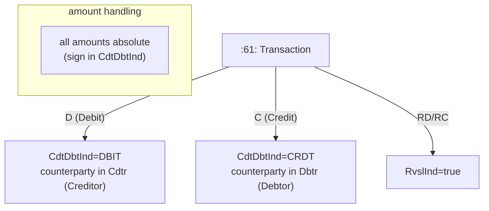

- Target: `camt.053.001.06`
- All amounts are absolute (positive): sign in CdtDbtInd
- Debit to Cdtr routing, credit to Dbtr routing
- NtryDtls always included (minimum: RmtInf with Ustrd)

## 6. Technology Stack

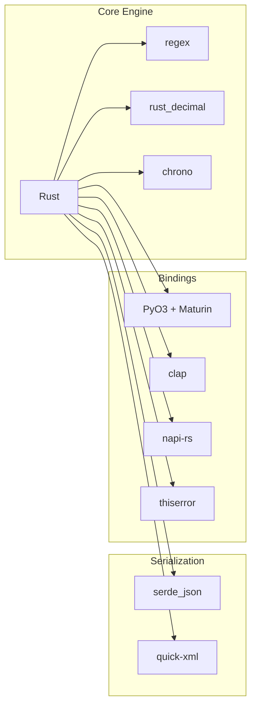

| Layer              | Technology          | Purpose                        |
|--------------------|---------------------|--------------------------------|
| Core parsing       | Rust + regex        | Tokenization, FSM, tag parsing |
| Decimal math       | `rust_decimal`      | Exact financial amounts        |
| Dates              | `chrono`            | Date parsing and formatting    |
| JSON output        | `serde_json`        | Serialize models to JSON       |
| XML output         | `quick-xml`         | camt.053 XML generation        |
| Python binding     | `pyo3` + `maturin`  | Native CPython extension       |
| Node.js binding    | `napi-rs`           | Native Node addon              |
| CLI                | `clap`              | Argument parsing               |
| Error handling     | `thiserror`         | Ergonomic error types           |

## 7. Testing Strategy

### 7.1 Three-Tier Rust Tests

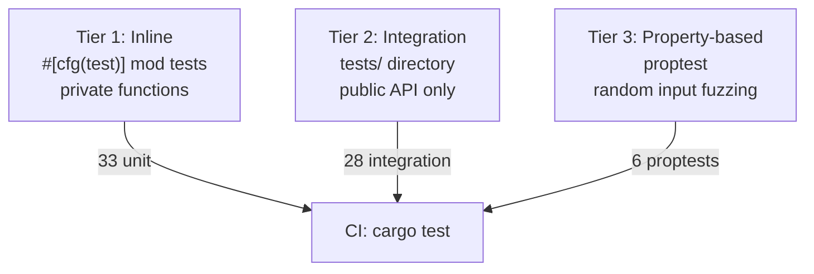

### 7.2 Test Coverage

| Layer            | Tests | Framework    |
|------------------|-------|--------------|
| Rust unit        | 33    | `#[cfg(test)]` |
| Rust integration | 28    | `tests/`       |
| Rust proptest    | 6     | proptest       |
| Python           | 39    | pytest         |
| Node.js (Rust)   | 8     | `#[cfg(test)]` |
| Node.js (JS)     | 35    | Node.js assert |
| CLI              | 9     | assert_cmd     |
| Doc tests        | 3     | rustdoc        |

### 7.3 Golden File Testing

Six `.sta` payloads in `tests/data/` across all four dialect types plus a
SWIFT continuation-line test. Tests parse each file and assert structured
output matches expectations.

## 8. Bindings Architecture

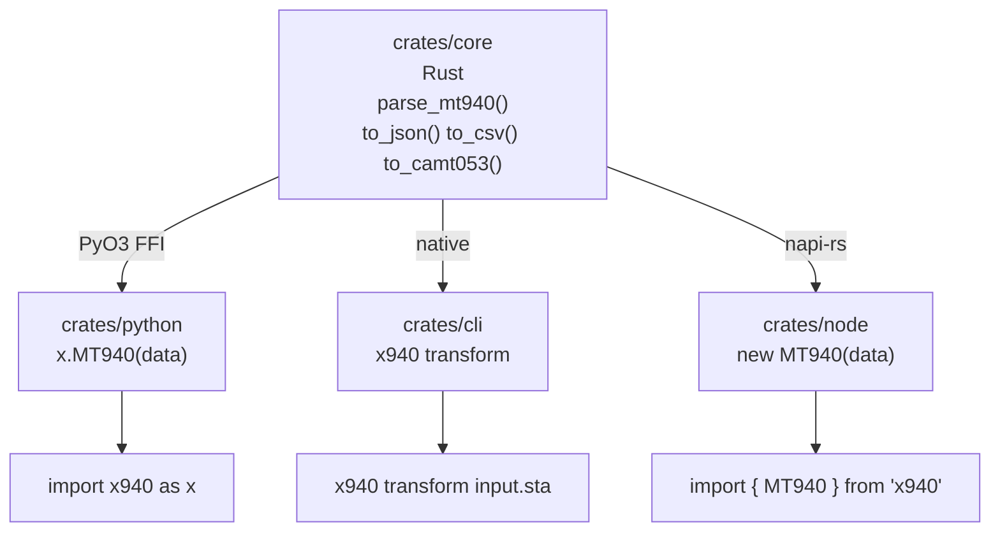

## 9. Known Limitations Addressed

x940 fixes the following defects found in the reference parser
(eu-invoice-tools):

| Limitation                    | x940 Fix                                       |
|-------------------------------|------------------------------------------------|
| Polish angular not parsed     | Native `AngularDecoder` implementation         |
| No structuredDetails for unstructured | Always include `{"detail": raw_text}`  |
| CSV multiline truncation      | Full concatenation before CSV serialization    |
| camt.053 missing NtryDtls     | Always include NtryDtls with RmtInf            |
| GBP amounts lose precision    | Always output 2 decimal places                 |
| :61: continuation lines       | SWIFT [34x] supplementary details parsed       |
