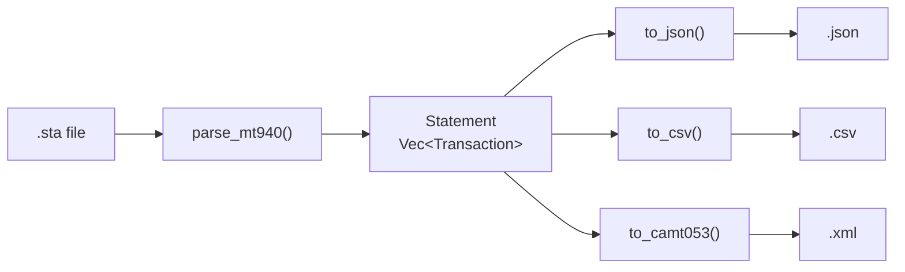
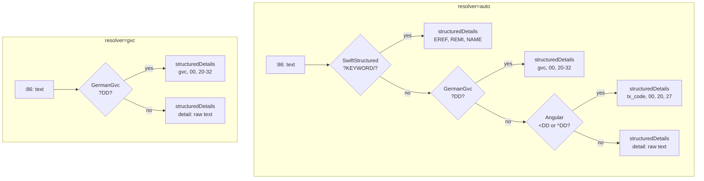
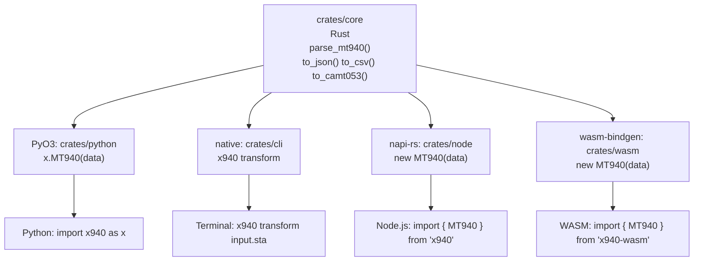

# x940: Usage Guide

In-depth usage examples across all language bindings. All examples use this
shared input file:

```
:20:DEMO2026
:25:EUR8934567890123456
:28C:00001/001
:60F:C260601EUR50000,00
:61:2606010601D1500,00NTRF//INV991
:86:/EREF/INV-2026-991/REMI/MONTHLY RETAINER FEES/NAME/ALPHA DIGITAL CORP/BIC/ALPHDEFFXXX
:61:2606020602C3250,75NTRF//RFB-882
:86:/EREF/TXN-882910/REMI/REIMBURSEMENT OVERHEAD/NAME/BETATECH LOGISTICS/BIC/BETAUS33XXX
:62F:C260602EUR51750,75
```



## Python

### Basic Usage

```python
import x940 as x

with open("statement.sta") as f:
    stmt = x.MT940(f.read())

print(f"Account:  {stmt.account}")
print(f"Currency: {stmt.currency}")
print(f"Opening:  {stmt.opening_balance:.2f}")
print(f"Closing:  {stmt.closing_balance:.2f}")

for tx in stmt.transactions:
    direction = "IN" if tx.is_credit else "OUT"
    print(f"  {direction} {tx.amount:>10.2f} | {tx.transaction_type} | {tx.counterparty}")

# Export from the same parsed data (no re-parse)
with open("output.json", "w") as f:
    f.write(stmt.to_json())
with open("output.csv", "w") as f:
    f.write(stmt.to_csv())
with open("output.xml", "w") as f:
    f.write(stmt.to_camt053())
```

### With Explicit Dialect

```python
import x940 as x

stmt = x.MT940(data, resolver="gvc")

print(f"Resolver used: {stmt.resolver_used}")

for tx in stmt.transactions:
    if tx.structured_details:
        gvc  = tx.structured_details.get("gvc", "?")
        name = tx.structured_details.get("32", "(unknown)")
        print(f"  GVC {gvc}: {name} -> {tx.counterparty}")
```

### One-Liners

```python
import x940 as x

x.MT940(data).to_json()
x.MT940(data, resolver="gvc").to_camt053()
x.MT940(open("statement.sta").read()).to_csv()
```

### Transaction Properties

```python
tx = stmt.transactions[0]

tx.value_date          # date object
tx.entry_date          # date object or None
tx.debit_credit        # "D", "C", "RD", or "RC"
tx.amount              # Decimal (always positive)
tx.signed_amount()     # Decimal (negative for debits)
tx.is_credit           # bool
tx.is_debit            # bool
tx.is_reversal         # bool
tx.transaction_type    # "NTRF", "NMSC", "N166", etc.
tx.customer_reference  # string
tx.bank_reference      # string or None
tx.details             # raw :86: text
tx.structured_details  # {"EREF": "...", "NAME": "...", ...} or None
tx.counterparty        # resolved counterparty name
tx.counter_iban        # resolved counterparty IBAN
tx.purpose             # resolved remittance/purpose text
```

### With DataFrames

```python
import x940 as x
import polars as pl

stmt = x.MT940(data)

df = pl.DataFrame([
    {
        "date": tx.value_date,
        "amount": tx.signed_amount(),
        "type": tx.transaction_type,
        "counterparty": tx.counterparty,
        "purpose": tx.purpose,
    }
    for tx in stmt.transactions
])

print(df)
```

### Web Server (FastAPI)

```python
from fastapi import FastAPI, UploadFile
import x940 as x

app = FastAPI()

@app.post("/parse")
async def parse(file: UploadFile):
    data = await file.read()
    stmt = x.MT940(data)

    return {
        "account": stmt.account,
        "currency": stmt.currency,
        "transactions": [
            {
                "date": tx.value_date.isoformat(),
                "amount": str(tx.signed_amount()),
                "type": tx.transaction_type,
                "counterparty": tx.counterparty,
                "purpose": tx.purpose,
            }
            for tx in stmt.transactions
        ],
    }

@app.post("/convert")
async def convert(file: UploadFile):
    data = await file.read()
    return {"xml": x.MT940(data, resolver="swift").to_camt053()}
```

## Node.js

```js
const { MT940 } = require("x940");
const fs = require("node:fs");

const data = fs.readFileSync("statement.sta", "utf8");
const stmt = new MT940(data, "auto");

// Inspection
console.log(`Account:  ${stmt.account}`);
console.log(`Currency: ${stmt.currency}`);
console.log(`Opening:  ${stmt.openingBalance.toFixed(2)}`);
console.log(`Closing:  ${stmt.closingBalance.toFixed(2)}`);

for (const tx of stmt.transactions) {
    const dir = tx.isReversal ? "REV" : (tx.amount < 0 ? "OUT" : "IN ");
    console.log(`  ${dir} ${tx.amount.toFixed(2)} | ${tx.transactionType} | ${tx.counterparty}`);
}

// Export
fs.writeFileSync("output.json", stmt.toJSON());
fs.writeFileSync("output.csv",  stmt.toCSV());
fs.writeFileSync("output.xml",  stmt.toCamt053());
```

### With Explicit Dialect

```js
const stmt = new MT940(data, "gvc");
console.log(`Resolver: ${stmt.resolverUsed}`);

for (const tx of stmt.transactions) {
    if (tx.structuredDetails) {
        const gvc  = tx.structuredDetails.gvc ?? "?";
        const name = tx.structuredDetails["32"] ?? "(unknown)";
        console.log(`  GVC ${gvc}: ${name} -> ${tx.counterparty}`);
    }
}
```

### One-Liners

```js
new MT940(data, "auto").toJSON();
new MT940(data, "gvc").toCamt053();
new MT940(fs.readFileSync("file.sta", "utf8"), "auto").toCSV();
```

### Transaction Properties

```js
const tx = stmt.transactions[0];

tx.valueDate          // "2026-06-01"
tx.entryDate          // "2026-06-01" or null
tx.debitCredit        // "D", "C", "RD", or "RC"
tx.amount             // signed (negative for debits)
tx.isReversal         // bool
tx.transactionType    // "NTRF", "NMSC", "N166", etc.
tx.customerReference  // string
tx.bankReference      // string or null
tx.details            // raw :86: text
tx.structuredDetails  // { EREF, NAME, ... } or null
tx.counterparty       // resolved counterparty name
tx.counterIban        // resolved counterparty IBAN
tx.purpose            // resolved remittance/purpose text
```

### Worker Threads (batch processing)

```js
const { Worker } = require("node:worker_threads");
const { MT940 } = require("x940");
const fs = require("node:fs");

const files = ["jan.sta", "feb.sta", "mar.sta"];
for (const file of files) {
    const data = fs.readFileSync(file, "utf8");
    const stmt = new MT940(data, "auto");
    console.log(`${file}: ${stmt.transactions.length} txns`);
}
```

## WASM

```js
import { MT940 } from "x940-wasm";

const response = await fetch("statement.sta");
const data = await response.text();
const stmt = new MT940(data, "auto");

// Inspection
console.log(`Account:  ${stmt.account}`);
console.log(`Currency: ${stmt.currency}`);
console.log(`Opening:  ${stmt.openingBalance.toFixed(2)}`);
console.log(`Closing:  ${stmt.closingBalance.toFixed(2)}`);

for (const tx of stmt.transactions()) {
    const dir = tx.isReversal ? "REV" : (tx.amount < 0 ? "OUT" : "IN ");
    console.log(`  ${dir} ${tx.amount.toFixed(2)} | ${tx.transactionType} | ${tx.counterparty}`);
}

// Export
console.log(stmt.toJson());
console.log(stmt.toCsv());
console.log(stmt.toCamt053());
```

### With Explicit Dialect

```js
const stmt = new MT940(data, "gvc");
console.log(`Resolver: ${stmt.resolverUsed}`);

for (const tx of stmt.transactions()) {
    // WASM transactions have getter-based properties (camelCase)
    console.log(`  ${tx.debitCredit} ${tx.amount} | ${tx.transactionType} | ${tx.counterparty}`);
}
```

### Transaction Properties

```js
const tx = stmt.transactions()[0];

tx.date              // "2026-06-01"
tx.entryDate         // "2026-06-01" or null
tx.debitCredit       // "D", "C", "RD", or "RC"
tx.amount            // signed (negative for debits)
tx.isReversal        // bool
tx.transactionType   // "NTRF", "NMSC", "N166", etc.
tx.customerReference // string
tx.bankReference     // string or null
tx.details           // raw :86: text
tx.counterparty      // resolved counterparty name or null
tx.counterIban       // resolved counterparty IBAN or null
tx.purpose           // resolved remittance/purpose text or null
```

Note: WASM `Transaction` objects use camelCase getters and `transactions()` is a
method call (not a property). Properties mirror the Node.js binding but follow
wasm-bindgen conventions.

## CLI

```bash
# Basic conversion
x940 transform statement.sta --format json --output result.json
x940 transform statement.sta --format csv  --output result.csv
x940 transform statement.sta --format camt053 --output result.xml

# With explicit dialect
x940 transform statement.sta --format camt053 --resolver gvc -o result.xml

# Pipe mode
cat statement.sta | x940 transform --format csv > transactions.csv

# Multi-format export (single parse)
x940 transform statement.sta --format json,csv,camt053 --output-prefix export_
# Produces: export_.json, export_.csv, export_.xml

# Batch processing
for f in statements/*.sta; do
    x940 transform "$f" --format json --output "json/${f%.sta}.json"
done

# Watch mode
watchexec -w statements/ "x940 transform statements/*.sta --format json --output out/"
```



## Rust

### Basic Usage

```rust
use x940rs::{parse_mt940, DecoderChain, to_json, to_csv, to_camt053};

fn main() -> Result<(), Box<dyn std::error::Error>> {
    let raw = std::fs::read_to_string("statement.sta")?;

    let chain = DecoderChain::auto();
    let statements = parse_mt940(&raw, &chain)?;

    let stmt = &statements[0];
    println!("Account:  {}", stmt.account_identification);
    println!("Currency: {}", stmt.currency());
    println!("Opening:  {:.2}", stmt.opening_balance.amount);
    println!("Closing:  {:.2}", stmt.closing_balance.amount);

    for (i, tx) in stmt.transactions.iter().enumerate() {
        println!(
            "Tx {:>2}: {:>10.2} | {} | {}",
            i + 1,
            tx.signed_amount(),
            tx.transaction_type,
            tx.counterparty().unwrap_or("(unknown)")
        );
    }

    std::fs::write("output.json", to_json(&statements)?)?;
    std::fs::write("output.csv",  to_csv(&statements)?)?;
    std::fs::write("output.xml",  to_camt053(&statements)?)?;

    Ok(())
}
```

### With Explicit Dialect

```rust
use x940rs::{parse_mt940, DecoderChain};

let chain = DecoderChain::with_resolver("gvc").unwrap();
let statements = parse_mt940(&raw, &chain)?;

for tx in &statements[0].transactions {
    if let Some(ref sd) = tx.structured_details {
        println!("GVC:    {}", sd.get("gvc").unwrap_or(&"?".into()));
        println!("Name:   {}", sd.get("32").unwrap_or(&"?".into()));
    }
}
```

### Streaming (large files)

```rust
use std::fs::File;
use std::io::BufRead;
use x940rs::{parse_mt940, DecoderChain};

let file = File::open("large_batch.sta")?;
let reader = std::io::BufReader::new(file);

// Accumulate lines until a complete statement boundary is found,
// then parse one statement at a time
let mut buffer = String::new();
for line in reader.lines() {
    let line = line?;
    // Check for statement boundary (:20: at start of line after prior completion)
    if line.starts_with(":20:") && !buffer.is_empty() {
        let chain = DecoderChain::auto();
        let statements = parse_mt940(&buffer, &chain)?;
        // Process statements one chunk at a time
        buffer.clear();
    }
    buffer.push_str(&line);
    buffer.push('\n');
}
```

## Cross-Language Consistency

All bindings share the same Rust core engine, providing identical parsing
results, dialect auto-detection, and export formats regardless of language.


